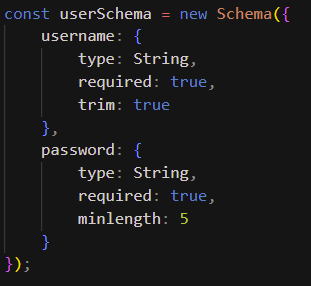
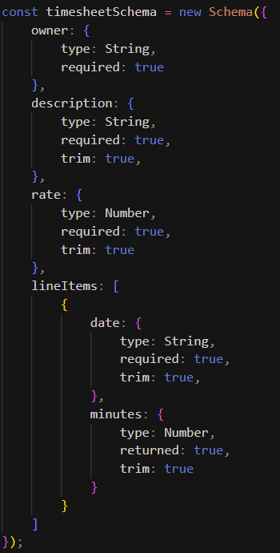
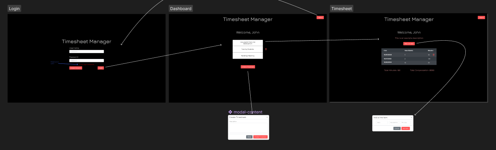

## **Timesheet Manager**

 

## <ins> Table of Contents: </ins>

- [Questions](#-questions-)
- [Description](#-description-)
- [Installation](#-installation-)
- [Usage](#-usage-)
- [Technologies and Programs Used](#-technologies-and-programs-used-)
- [Demonstration](#-demonstration-)
- [Figma Wireframe](#-figma-wireframe-)
- [Links](#-links-)
- [Credits](#-credits-)
- [License](#-license-)

    

## <ins> Questions? </ins>

- Maung Htike
### Email: maunghtike1999@gmail.com
 

## <ins> Description: </ins>
This is a program constructed utilizing the MERN stack. The application allows a user to be able to create a new account, login, logout, and CRUD (create, update, delete) operations on timesheets as well as the line items associated with those timesheets. JSON web tokens are used for user authentication.

     

## <ins> Installation: </ins>
        
The webpage is deployed on Heroku so there is no need to download any of the files to run the program. If you would like to instead install it locally, please download all the files included in the repository. Afterwards, please open your terminal into the repository root folder and utilize Node.js's npm install feature to install all the used packages. If you do not have NodeJS installed, go to https://nodejs.org/en/ and download the "LTS" version and follow along through the installer. Then, load up the program by running the develop script.
 ***npm i*** 
 ***npm run develop*** 

## <ins> Usage: </ins>
        
To start the program via Heroku, please go to https://timesheet-manager-mh.herokuapp.com/. If you would like to start the program locally, please follow the local installation steps and type in ***npm run develop***. You will then be able to go to the proper routes to see the webpage.   
If you would like to create an account, please click fill in the login form with a username and password and press the "Create Account" button. To login, fill in your username and password and press "Login".   
Then you will be able to create a timesheet by pressing "Create Timesheet" and filling in the proper text fields. To update, press edit on the specific timesheet and fill in the new data. To delete a timesheet, press the "Delete" button right next to the timesheet you wish to delete. To view the timesheet, press on the letters on the respective timesheet.  
Within each timesheet is a table of dates and minutes. To add a new line item, press "Add Line Item" and fill in the text fields. To update, press "Edit" and fill in the new values. To delete a line item, press the "Delete" button. The app should automatically calculate the sum of all the minutes and cost of the entire timesheet below the table.

   

## <ins> Technologies and Programs Used: </ins>
 

### *Tools:*

### *Front-End:*

### *Back-End:* 

 

## <ins> The Process: </ins>

Since this a full stack project, I started out with figuring out how my backend data would look because the program itself is heavily based on parsing that data and displaying it on the front end. I would not be able to design the front end that well without knowing what I am working with, so I started out with a rough model for the database. I decided to use MongoDB and with it, figured
out how the user, timesheet, and line items would work with each other. I decided that since line items are directly related to the timesheets, I figured it would be easier to store the line items as an array of objects under the timesheet model itself. 
    
 
Once that was done, then creating functions that would run requests that would be made on the front-end. The one bonus of using Apollo client and GraphQL is that once you have the model and schema set up, you can test the backend without even having a front-end, and I utilized this to isolate if it was specifically the front or back end causing errors in the code.   
With the back-end working for the most part, the next step was to actually draft up a wireframe for the front-end and how I might be able to work with the data models I constructed. Using Figma, I was able to create a fairly simple but effective interface. 

 

Then translating that figma wireframe into an actual front-end UI. Once I had the proper html elements in place, It was then time to write code that would be able to use CRUD operations by connecting to the back-end database. While I assumed that the creation of the back-end would be the hardest portion, I was in for a nice surprise when it came to the implementation of it. I was able to get the application working locally after a fair amount of time, however, once it was deployed there were many issues with MongoDB and Heroku. After numerous little tweaks here and there, the deployed application was finally working without bugs.   

The program for the most part, has good validation. It is able to throw an error on the UI if the user is missing a textbox or has an invalid input.

## <ins> Figma Wireframe: </ins>

https://www.figma.com/file/XWFDSnqV5I7MM9Fc8xYLi6/Untitled?node-id=0%3A1&t=3T92ezAJqvZV9iB0-1

     

## <ins> Links: </ins>
        
- [Heroku Deployed Website](https://timesheet-manager-mh.herokuapp.com/)
- [Github Repository](https://github.com/Sfzmango/accrualify-assessment-timesheet)
      

## <ins> Credits: </ins>

Made by Maung Htike
 

## <ins> License </ins>

MIT License

Copyright (c) 2022 Memory Lane Team

Permission is hereby granted, free of charge, to any person obtaining a copy
of this software and associated documentation files (the "Software"), to deal
in the Software without restriction, including without limitation the rights
to use, copy, modify, merge, publish, distribute, sublicense, and/or sell
copies of the Software, and to permit persons to whom the Software is
furnished to do so, subject to the following conditions:

The above copyright notice and this permission notice shall be included in all
copies or substantial portions of the Software.

THE SOFTWARE IS PROVIDED "AS IS", WITHOUT WARRANTY OF ANY KIND, EXPRESS OR
IMPLIED, INCLUDING BUT NOT LIMITED TO THE WARRANTIES OF MERCHANTABILITY,
FITNESS FOR A PARTICULAR PURPOSE AND NONINFRINGEMENT. IN NO EVENT SHALL THE
AUTHORS OR COPYRIGHT HOLDERS BE LIABLE FOR ANY CLAIM, DAMAGES OR OTHER
LIABILITY, WHETHER IN AN ACTION OF CONTRACT, TORT OR OTHERWISE, ARISING FROM,
OUT OF OR IN CONNECTION WITH THE SOFTWARE OR THE USE OR OTHER DEALINGS IN THE
SOFTWARE.